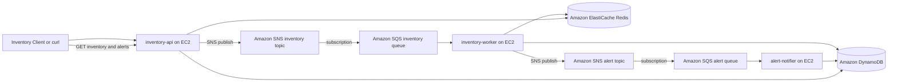

# JHU Module 7 Distributed Cloud Application

This repository contains a distributed candy-store inventory reorder system for the Module 7 cloud assignment. It intentionally does **not** use functions, containers, Kubernetes, or a service mesh.

The earlier Cloudflare Workers idea would fail the assignment because Workers are functions. This version uses EC2 virtual machines for the three executables and managed AWS services for the required cloud components.

## Business Process

A candy store sends inventory updates into the system. The application decides whether the product is below its reorder threshold, stores the current inventory state, records reorder alerts, and records a notification audit entry for the manager workflow.

Example rule:

```text
If quantity <= reorder_threshold, create or update an open reorder alert.
If quantity > reorder_threshold, mark existing open alerts for that SKU as resolved.
```

## Required Components

| Requirement | Implementation |
| --- | --- |
| Three processes or executables | `inventory-api`, `inventory-worker`, `alert-notifier` |
| Messaging | Amazon SNS topics for inventory update and reorder alert events |
| Queuing | Amazon SQS queues subscribed to the SNS topics |
| Caching | Amazon ElastiCache Redis for API read-through cache |
| Database | Amazon DynamoDB tables for inventory, alerts, and notification audit |
| Cloud deployment | EC2 instances run the three processes; managed AWS services provide state and coordination |
| Banned items avoided | No functions, no containers, no Kubernetes, no service mesh |

## Architecture



## Executables

`inventory-api`
: HTTP API that accepts inventory updates, publishes events to SNS, and serves inventory/alert reads through Redis plus DynamoDB.

`inventory-worker`
: Long-running SQS worker that consumes inventory events, applies the reorder rule, writes DynamoDB records, updates Redis, and publishes alert events.

`alert-notifier`
: Long-running SQS worker that consumes alert events and records notification audit entries. It simulates manager notification without adding email, SMS, or any extra cloud component outside the assignment scope.

## Local Development

Local execution requires Python 3.11+.

```bash
python3 -m venv .venv
source .venv/bin/activate
pip install -e ".[dev]"
cp .env.example .env
pytest
```

For real execution, the environment variables in `.env.example` must point to the AWS resources created by `infra/terraform`.

Run the three processes in separate terminals after AWS resources exist:

```bash
inventory-api
inventory-worker
alert-notifier
```

## API Demo

Submit a low-stock inventory update:

```bash
curl -sS -X POST http://EC2_API_PUBLIC_IP:8000/inventory \
  -H 'content-type: application/json' \
  -d '{"sku":"GUMMY-001","name":"Sour Gummy Worms","quantity":8,"reorder_threshold":10,"vendor":"Acme Candy Supply"}' | jq
```

Review current inventory:

```bash
curl -sS http://EC2_API_PUBLIC_IP:8000/inventory/GUMMY-001 | jq
```

Review open alerts:

```bash
curl -sS http://EC2_API_PUBLIC_IP:8000/alerts | jq
```

Resolve the alert by sending a healthy quantity:

```bash
curl -sS -X POST http://EC2_API_PUBLIC_IP:8000/inventory \
  -H 'content-type: application/json' \
  -d '{"sku":"GUMMY-001","name":"Sour Gummy Worms","quantity":40,"reorder_threshold":10,"vendor":"Acme Candy Supply"}' | jq
```

## Documentation

- [Project report](docs/report.md)
- [AWS deployment guide](docs/deployment_aws_ec2.md)
- [Screenshot checklist](docs/screenshots/README.md)
- [Terraform infrastructure](infra/terraform)

## Submission Notes

The instructor-facing submission should include this private GitHub repository link plus screenshots showing:

1. The three EC2 processes running.
2. SNS topics and SQS queues.
3. DynamoDB inventory, alert, and notification records.
4. ElastiCache Redis endpoint.
5. `POST /inventory` creating a reorder alert end-to-end.
6. `GET /alerts` returning the open alert.
